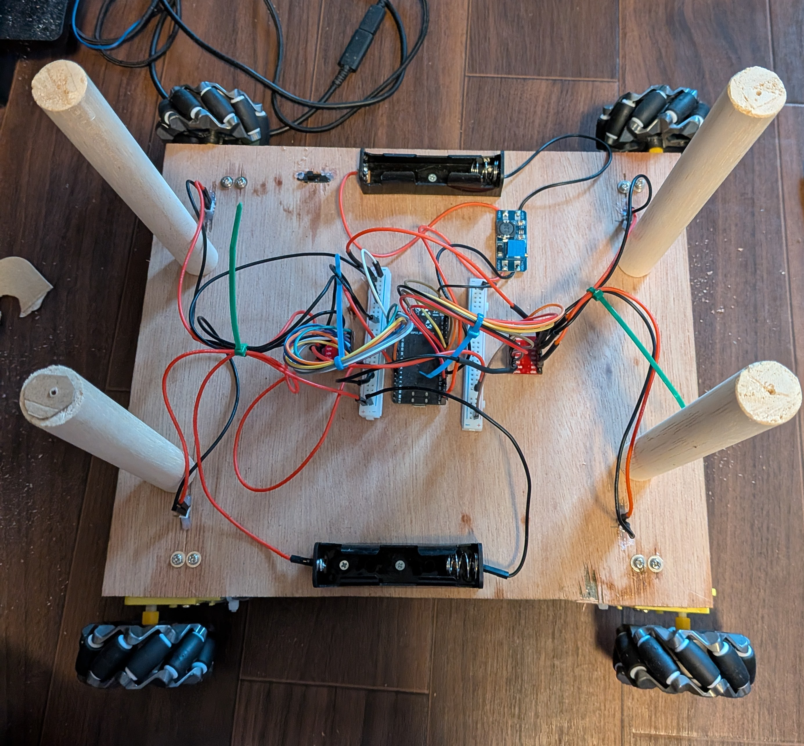
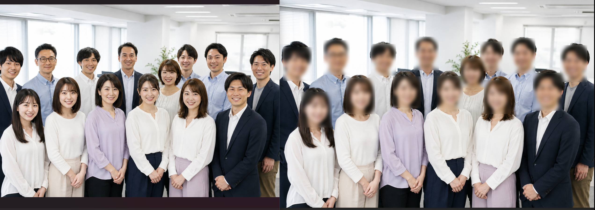
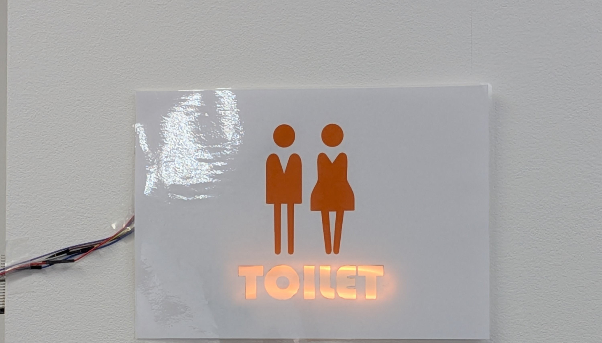
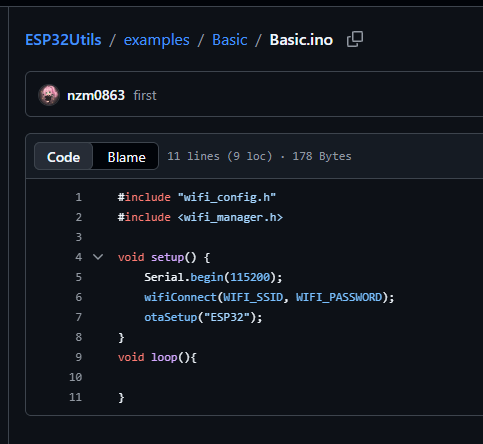
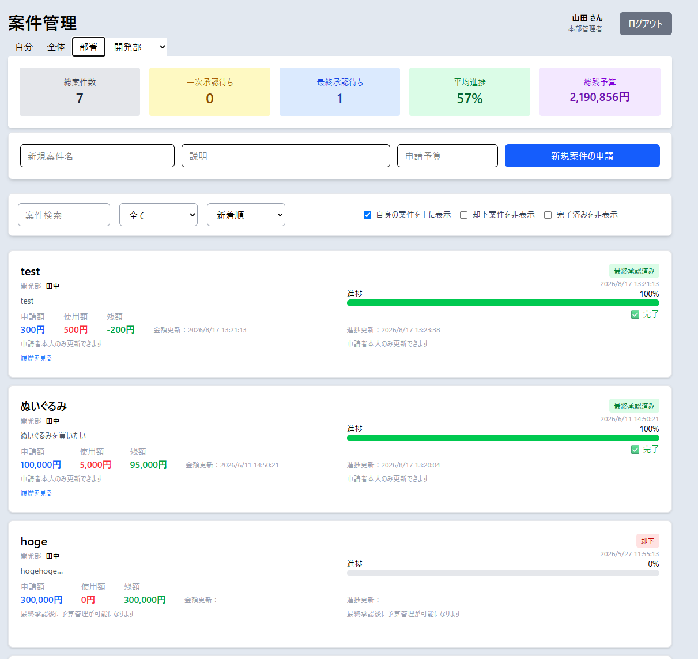
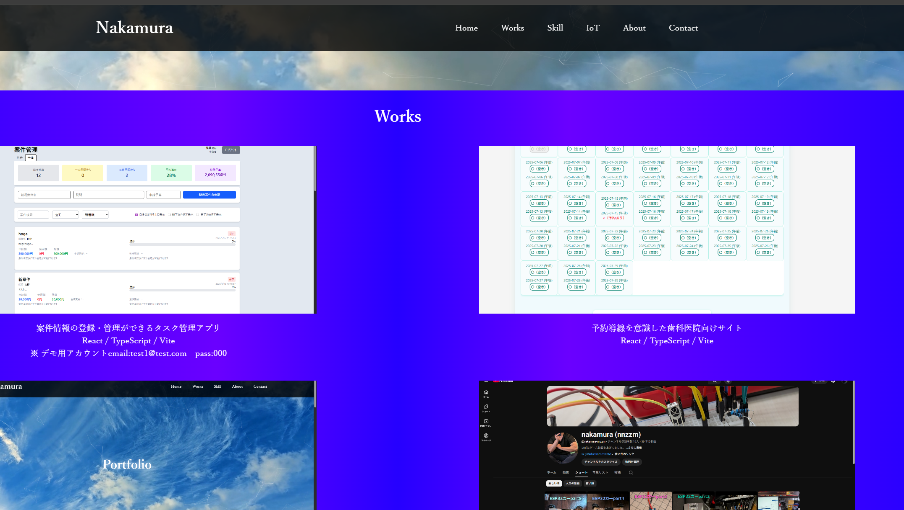
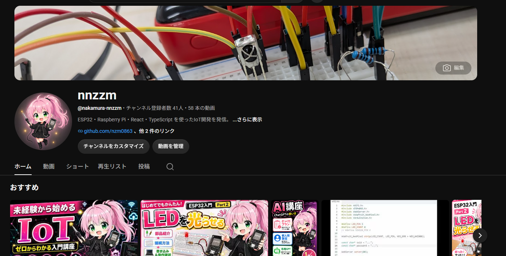

# Hi, I'm nnzzm 👋

IoT / Web / AI Developer

Building open-source IoT, Robotics and AI tools with ESP32, Raspberry Pi, React and Python.

## Interests
- Web × Hardware
- IoT
- Embedded systems

## Skills
- TypeScript
- React
- ESP32
- Arduino
- mDNS
- Git / GitHub

## Currently Learning
- Supabase
- SQL
- Database Design
- Backend Development
- Next.js

## Projects

### 🤖 ESP32 Omni Wheel Car

Four-wheel omni-directional robot platform powered by ESP32.

**Repository**  
https://github.com/nzm0863/IoT_ESP32Car

---

### 🖼️ AI Image Processing

AI-powered image processing tool using YOLO11 Segmentation and OpenCV.

**Repository**  
https://github.com/nzm0863/AI_Image_processing

---

### 🚽 IoT Toilet Notification

Real-time toilet occupancy notification system with ESP32.

**Repository**  
https://github.com/nzm0863/IoT_toilet_notification

---

### 📚 ESP32Utils

Reusable Wi-Fi, OTA and utility library for ESP32 projects.

**Repository**  
https://github.com/nzm0863/ESP32Utils

---

### 🚀 TaskFlow
Task and project management application developed during an internship program.

Designed to manage projects, tasks, users and departments through a centralized dashboard.

**Features**
- Project creation and management
- Task assignment and status tracking
- User and department administration
- Role-based access control
- Authentication and login system

**Tech Stack**
- ESP32 (IoT integration)
- React
- TypeScript
- Vite
- PHP
- MySQL
- Tauri

Repository  
https://github.com/nzm0863/taskflow-app

Demo  
https://www.nnzzm.com/project_management/

---

### 🌐 Portfolio Site

Portfolio website for IoT, Web and AI development projects.

**Website**  
https://www.nnzzm.com/

**Source Code**  
https://github.com/nzm0863/portfolio

## Featured Content

### 📺 YouTube Channel

Development logs and demonstrations of ESP32, Raspberry Pi and AI projects.

**Channel**
https://youtube.com/@nakamura-nnzzm
